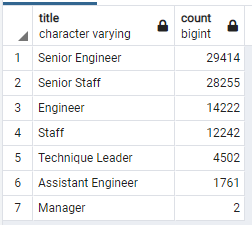
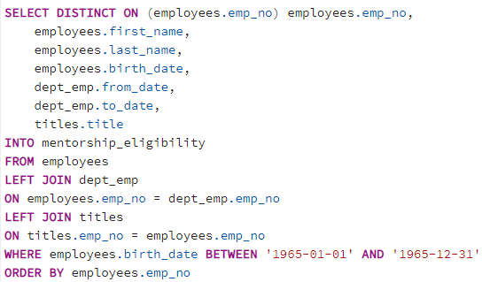

# Pewlett-Hackard-Analysis

### Overview
Pewlett Hackard is a large organization with over 300,000 employees. Leadership of this firm is concerned about the pending "silver tsunami" which could impact the firm's future succes. This silver tsunami is not being triggered to tectonic plate movement but by the significant number of employees with the firm that are nearing retirement age. These employees are generally defined as those who were born between 1952 and 1955. Management is worried about staffing projects as senior employees retire, so they are also highly concerned with training the next generation of employees, which has been identified as employees born in 1965.

### Results
* Figure 1 shows the positions that soon to be reiting employees currently hold. These could potentially become capabilities and knowledge gaps if the shortcomings are not addressed.
* The positions with the largest gaps are Senior Engineers (29,414) and Senior Staff (28,255). Luckily, only 2 Managers are due to retire in the next few years.

#### Figure 1

* There are 1,940 employees who were born in 1965 and are eligibile for mentorship. This was determined using the code in Figure 2.
* If leadership does not expand the number of employees eligible for mentorship, then the silver tsunami could devistate the firm's performance

#### Figure 2

### Summary
- The number of roles that will need to be filled as the silver tsunami begins to make an impact are 90,398 positions. 
- There are over 300,000 employees in the company so theoretically there could be enough employees to fill the gaps of 90,398 positions. However the company will  need to focus on recruiting additional talent in order to continue growing. Developing exisitng human capital and retaining current workforce are critical.
